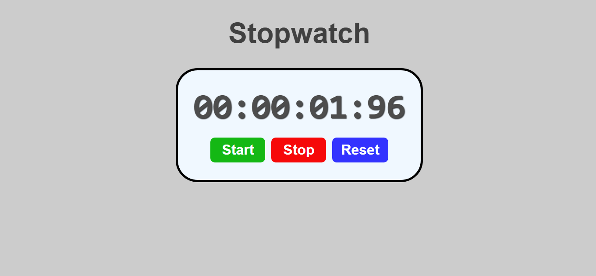

# React Stopwatch App

This is a simple stopwatch application built using React. The app allows users to start, stop, and reset a stopwatch, with the elapsed time displayed in minutes, seconds, and milliseconds.

## 🌐 Live Demo

[View the live project here!](https://laibatariq110.github.io/Stopwatch-Program)


## Features

- Start: Begin timing.
- Stop: Pause the timer.
- Reset: Reset the timer to 0.

## Project Structure

The project contains the following key files inside the `src` folder:

- `App.jsx`: Main app component.
- `Stopwatch.jsx`: Core logic for the stopwatch.
- `index.css`: Basic styles for the app.
- `main.jsx`: Entry point for rendering the app.

### Folder Structure:

src │ ├── assets # Optional folder for static assets ├── App.jsx # Main app component ├── Stopwatch.jsx # Stopwatch component containing the logic ├── index.css # Styling for the app └── main.jsx # Entry point for rendering the app

## Installation

To get started with the React Stopwatch App, follow these steps:

1. **Clone the repository**:
   ```bash
   git clone https://github.com/laibatariq110/Stopwatch-Program-React.git

2. **Navigate to the project directory**:
   ```bash
   cd Stopwatch-Program-React

3. **Install the dependencies**:
   ```bash
   npm install

4. **Start the development server**:
   ```bash
   npm run dev

## License

This project is licensed under the MIT License - see the [LICENSE](LICENSE) file for details.
